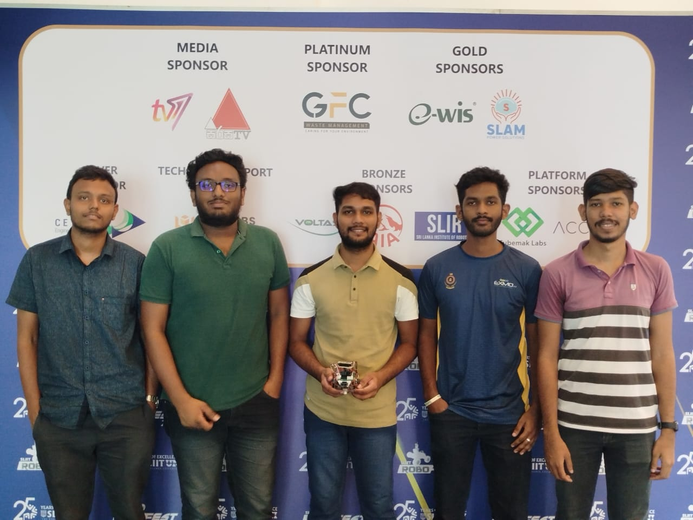
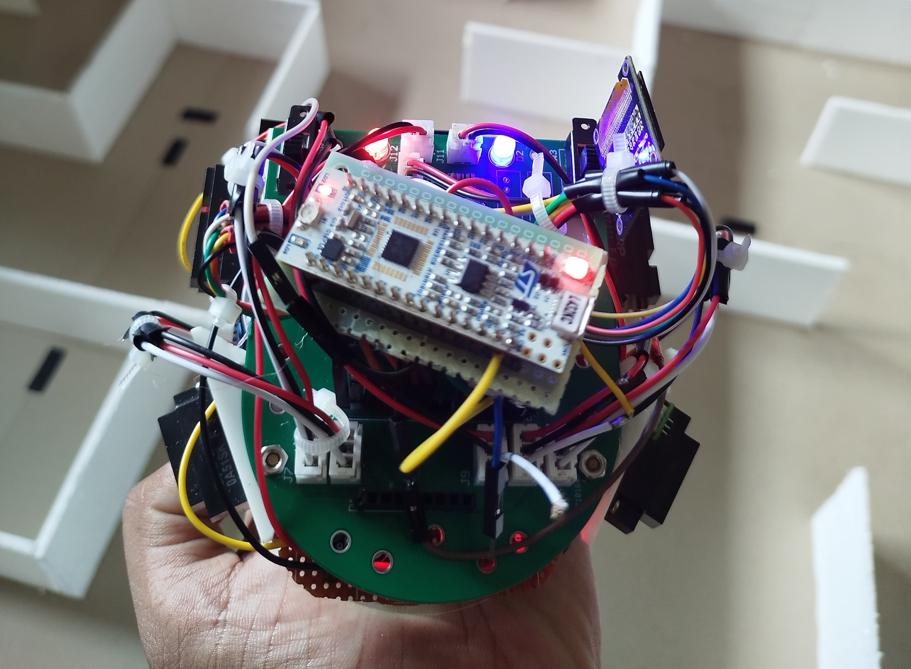

# Micro-Mouse-Design RoboFest

ROBOFEST is an annual robotics competition organized by the Sri Lanka Institute of Information Technology (SLIIT), where participants demonstrate their skills in designing and building robots. The 2024 university category features an exciting Micromouse challenge, where fully autonomous robots navigate mazes, showcasing innovation and technical prowess.

## Our Team

Our team, **"The ImagineX"** consists of:

-  Sahan Dissanayaka
-  Dilshan Nuwantha
-  Ruchira Abeywardhana
-  Pasindu Kulasingham
-  Senum Dodangoda

## Our Robot

## Our Task

For detailed information about our task, please refer to the attached PDF document.

[Download Task PDF](ROBOFEST-2024-University-Category.pdf)

## Project Objectives

The objective of the contest is to design and build a Micromouse with adaptive intelligence to explore
and navigate different maze configurations and solve the maze in the shortest time possible

## Team Achievements

👏 Each member conquered challenges, turning them into triumphs! 🌟 Get ready to witness the Titan Robot revolution! 🚀🤖
